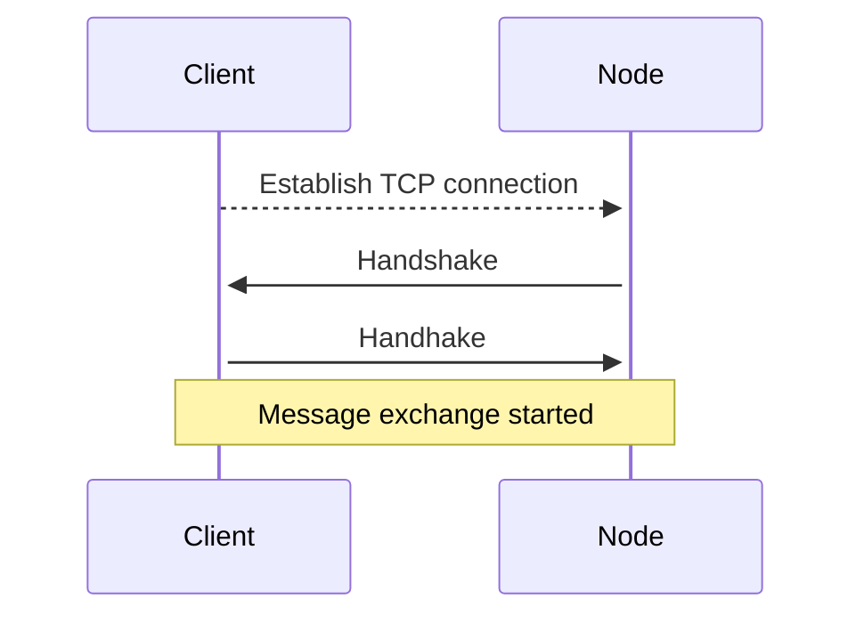
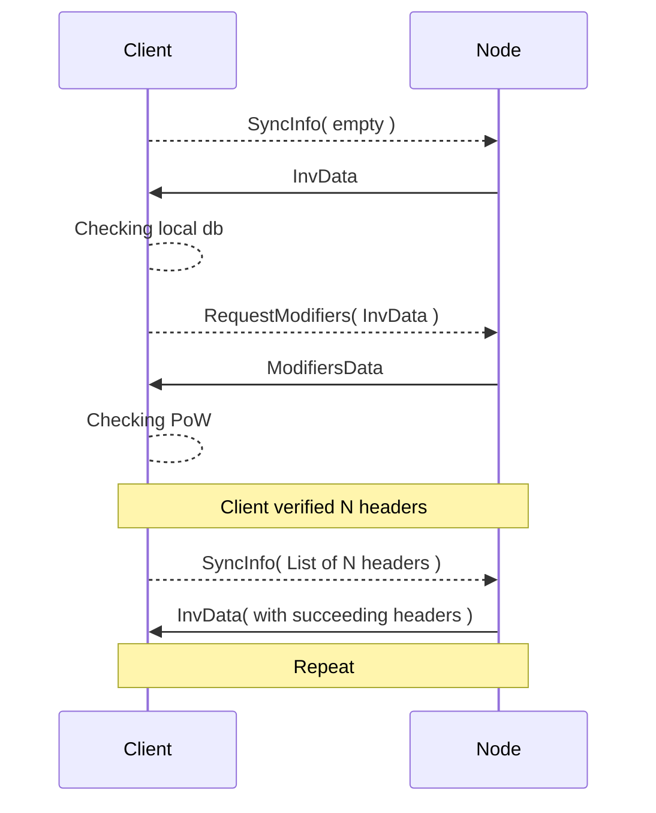

# ergo-core

Toy working example client code available [here](https://github.com/ccellado/ergo-test-client/tree/main).

## Establishing connections to the node



### Connect to peer 📞
First connect to peer node and get `Handshake` message.

For the rest of the guide assume the `Message body` as `byteBuffer`.
```scala
import org.ergoplatform.network.HandshakeSerializer

{ byteBuffer =>
  val handshake = HandshakeSerializer.parseBytesTry(byteBuffer)
}
```

### Handshake 🤝
After getting and successfully reading `Handshake` message from peer, the peer expects to receive the `Handshake` back

Create PeerSpec and all parameters (including features)
[PeerSpec](src/main/scala/org/ergoplatform/settings/PeerFeatureDescriptors.scala)'s doc:
```
* Declared information about peer
  *
  * @param agentName       - Network agent name. May contain information about client code
  *                        stack, starting from core code-base up to the end graphical interface.
  *                        Basic format is `/Name:Version(comments)/Name:Version/.../`,
  *                        e.g. `/Ergo-Scala-client:2.0.0(iPad; U; CPU OS 3_2_1)/AndroidBuild:0.8/`
  * @param protocolVersion - Identifies protocol version being used by the node
  * @param nodeName        - Custom node name
  * @param declaredAddress - Public network address of the node if any
  * @param features        - Set of node capabilities
```
```scala
import org.ergoplatform.network.PeerSpec
import org.ergoplatform.network.Version
import java.net.InetSocketAddress

val mySpec = PeerSpec(
  agentName = "morphicus",
  protocolVersion = Version("version of the ergo-core library"),
  nodeName = "ToTheMoon",
  // required for non-local communication
  declaredAddress = Some(InetSocketAddress("tothemoon.ergo", "5016")),
  // note [1]
  features = Seq.empty
)
```

[1] All the available peer features [PeerFeatureDescriptors](src/main/scala/org/ergoplatform/settings/PeerFeatureDescriptors.scala)


Create Handshake message with peer spec and UNIX time of the message
```scala
import org.ergoplatform.network.Handshake
import org.ergoplatform.network.PeerSpec
import org.ergoplatform.network.HandshakeSerializer

val handshakeMessage = Handshake(mySpec, System.currentTimeMillis())
val handshakeMessageSerialized = HandshakeSerializer.toBytes(handshakeMessage)
```
Serialize the message and send it.
If the message arrived successfully, start communicating with the peer node.

All communication is wrapped with Message headers, format described [here](https://docs.ergoplatform.com/dev/p2p/network/#message-format).

## Syncing with the node



The peer node will start sending `SyncInfo` messages to us, since it is checking for new block information.
Our client is syncing instead.

### Send [ErgoSyncInfoV2](src/main/scala/org/ergoplatform/nodeView/history/ErgoSyncInfo.scala) ♲
with empty `lastHeaders`, so the node knows client is just beginning to sync

```scala
import org.ergoplatform.nodeView.history.ErgoSyncInfoV2
import org.ergoplatform.nodeView.history.ErgoSyncInfoMessageSpec

val syncMessage = ErgoSyncInfoV2(Seq())
val syncMessageSerialized = ErgoSyncInfoMessageSpec.toBytes(syncMessage)
```
Node replies with [InvData](src/main/scala/org/ergoplatform/network/message/InvData.scala) message, containing youngest headers id's the node has.
Here the client checks if it has the headers already verified in its local db. The semantics of this is out of the tutorial scope.

Reply with `RequestModifier` message containing `InvData` the peer node sent previous.

### Send [RequestModifiers](src/main/scala/org/ergoplatform/network/message/RequestModifierSpec.scala) 📥

```scala
import org.ergoplatform.network.message.InvSpec
import org.ergoplatform.network.message.RequestModifierSpec

{ byteBuffer =>
  val invData = InvSpec.parseBytesTry(byteBuffer)
  val message = RequestModifierSpec.toBytes(invData)
}
```
Now received [ModifiersData](src/main/scala/org/ergoplatform/network/message/ModifiersData.scala) with block data.

### Checking the PoW headers 🕵️

Before adding those blocks to local database, check the headers.

```scala
import org.ergoplatform.network.message.ModifiersSpec
import org.ergoplatform.modifiers.history.header.HeaderSerializer

{ byteBuffer =>
  val data = ModifiersSpec.parseBytes(byteBuffer)
  val blockDataVerified = data.modifiers.map((id, bytes) =>
    (id, HeaderSerializer.parseBytes(bytes))
  )
}
```
If successful, `blockDataVerified` contains the map with `Headers` of block data. Cheers 🙌

## Checking NiPoPoW proofs

[What is NiPoPoW](https://docs.ergoplatform.com/dev/protocol/nipopows/)

### Request NiPoPoW proof 🛸

```scala
import org.ergoplatform.network.message.{GetNipopowProofSpec, NipopowProofData}
import org.ergoplatform.nodeView.history.ErgoHistoryUtils.{P2PNipopowProofM, P2PNipopowProofK}

val nipopowRequest = GetNipopowProofSpec.toBytes(
  NipopowProofData(
    m = P2PNipopowProofM,
    k = P2PNipopowProofK,
    None
  )
)
```

Received the [NipopowProofSpec](src/main/scala/org/ergoplatform/network/message/NipopowProofSpec.scala) message.

### Verify NiPoPoW proof 🦾

Need to have [chainSettings](src/main/scala/org/ergoplatform/settings/ChainSettings.scala) in order to make a `nipopoSerializer` instance.

```scala
import org.ergoplatform.modifiers.history.popow.{NipopowAlgos, NipopowProofSerializer}
import org.ergoplatform.network.message.NipopowProofSpec

lazy val nipopowAlgos: NipopowAlgos = new NipopowAlgos(chainSettings)
lazy val nipopowSerializer = new NipopowProofSerializer(nipopowAlgos)

{ byteBuffer =>
  val data = NipopowProofSpec.parseBytes(byteBuffer)
  val proofData = nipopowSerializer.parseBytes(data)
}
```

If successful, `proofData.isValid` will be true. Cheers 👽 